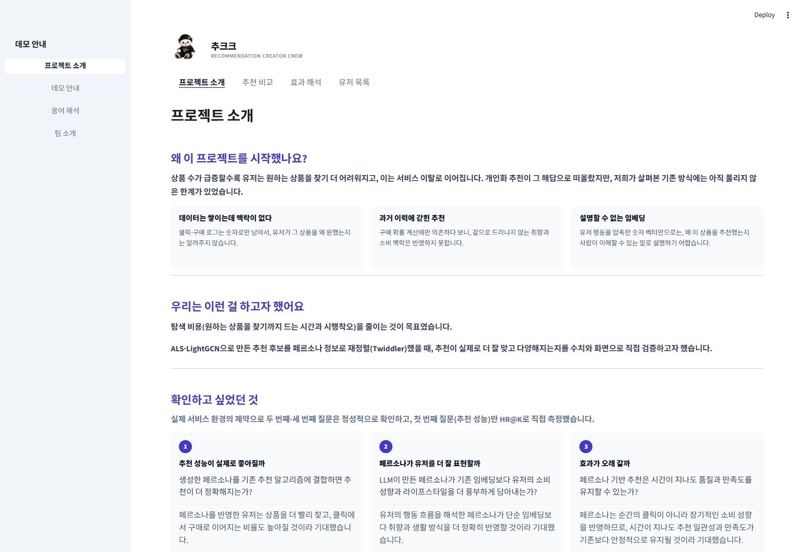
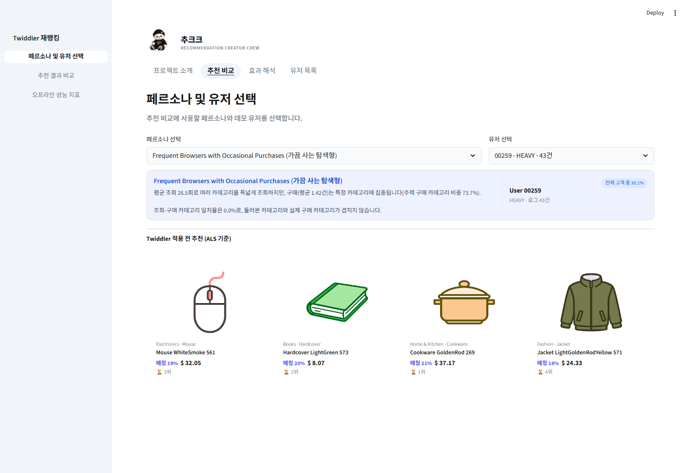
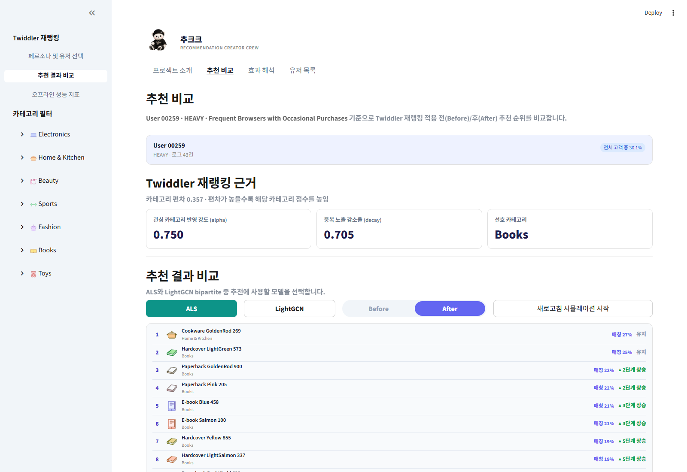
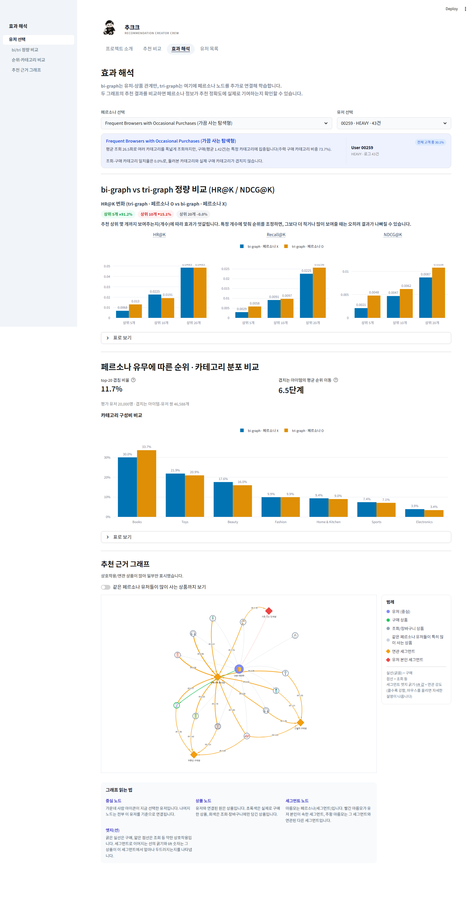
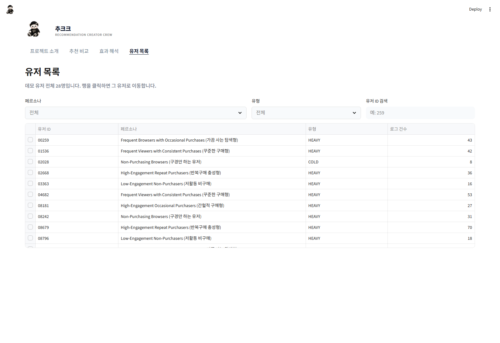

# 추크크 (Recommendation Creator Crew)

ecommerce-funnel-analysis의 행동 프로필·페르소나 피처를 입력으로 받아, 유저에게 카테고리·상품·재참여
콘텐츠를 추천하는 시스템. 분석가용 실험 로직과 이해관계자용 데모 화면을 한 Streamlit 앱으로 제공한다.

**🚀 UI 데모 바로가기: [recommendation-creator-crew.streamlit.app](https://recommendation-creator-crew.streamlit.app/)**

---

## 프로젝트 소개

### 왜 이 프로젝트를 시작했나요?

상품 수가 급증할수록 유저는 원하는 상품을 찾기 더 어려워지고, 이는 서비스 이탈로 이어진다. 개인화
추천이 그 해답으로 떠올랐지만, 기존 방식에는 아직 풀리지 않은 한계가 있었다.

| 한계 | 설명 |
|------|------|
| 데이터는 쌓이는데 맥락이 없다 | 클릭·구매 로그는 숫자로만 남아서, 유저가 그 상품을 왜 원했는지는 알려주지 않는다. |
| 과거 이력에 갇힌 추천 | 구매 확률 계산에만 의존하다 보니, 겉으로 드러나지 않는 취향과 소비 맥락은 반영하지 못한다. |
| 설명할 수 없는 임베딩 | 유저 행동을 압축한 숫자 벡터만으로는, 왜 이 상품을 추천했는지 사람이 이해할 수 있는 말로 설명하기 어렵다. |

### 우리는 이런 걸 하고자 했어요

탐색 비용(원하는 상품을 찾기까지 드는 시간과 시행착오)을 줄이는 것이 목표였다. ALS·LightGCN으로 만든
추천 후보를 페르소나 정보로 재정렬(Twiddler)했을 때, 추천이 실제로 더 잘 맞고 다양해지는지를 수치와
화면으로 직접 검증하고자 했다.

### 확인하고 싶었던 것

실제 서비스 환경의 제약으로 두 번째·세 번째 질문은 정성적으로 확인하고, 첫 번째 질문(추천 성능)만
HR@K로 직접 측정했다.

1. **추천 성능이 실제로 좋아질까** — 생성한 페르소나를 기존 추천 알고리즘에 결합하면 추천이 더
   정확해지는가?
2. **페르소나가 유저를 더 잘 표현할까** — LLM이 만든 페르소나가 기존 임베딩보다 유저의 소비 성향과
   라이프스타일을 더 풍부하게 담아내는가?
3. **효과가 오래 갈까** — 페르소나 기반 추천은 시간이 지나도 품질과 만족도를 유지할 수 있는가?

### 검증 결과와 최종 설계

**모델 실험 (bi-graph vs. tri-graph 성능 비교)**
페르소나 노드를 포함하지 않은 bi-graph와 페르소나 노드를 추가한 tri-graph의 HR@K·NDCG@K를 비교했다.
일부 설정에서는 tri-graph 성능이 개선됐지만, 하이퍼파라미터에 따른 변동성이 커 일관된 개선이라고
판단하기 어려웠다. 따라서 최종 데모에서는 페르소나를 후보 생성 모델에 직접 결합하기보다, 안정적으로
생성된 후보를 후처리 단계에서 재정렬하는 방식을 사용했다.

**최종 설계 (안정적인 후보 생성 + 설명 가능한 후처리 재랭킹)**
1. ALS와 LightGCN으로 추천 후보를 생성한다.
2. Twiddler로 페르소나와 노출 이력을 반영해 재정렬한다.
3. 추천 순위가 변경된 이유를 화면에 함께 제공한다.

---

## UI 데모 핵심 기능

데모는 상단 탭 4개(프로젝트 소개 · 추천 비교 · 효과 해석 · 유저 목록)로 구성된다.

### 1. 프로젝트 소개
접속 시 가장 먼저 보이는 화면으로, 위 프로젝트 소개 내용과 데모 안내·용어 해석·팀 소개를 사이드바로
제공한다.



### 2. 추천 비교 — 페르소나·유저 선택
활동량(Cold/Heavy)과 구매 성향이 다른 데모 유저를 페르소나별로 선택하면, Twiddler 적용 전(before)
추천 미리보기를 바로 확인할 수 있다.



### 3. 추천 비교 — Before/After 재랭킹
ALS ↔ LightGCN 모델을 토글하고, Twiddler 재랭킹 적용 전/후 추천 순위를 카드 그리드로 비교한다. 각
상품에는 관심 카테고리 반영 강도(alpha)·중복 노출 감소율(decay) 같은 재랭킹 근거와, 순위가 몇 단계
오르내렸는지를 함께 보여준다. "새로고침 시뮬레이션"으로 반복 방문 시 노출 이력이 누적돼 순위가
실제로 바뀌는 과정도 라이브로 볼 수 있다.



### 4. 효과 해석
bi-graph(유저-상품 관계만 학습)와 tri-graph(페르소나 노드 추가 학습)의 HR@K/NDCG@K를 정량 비교하고,
페르소나 유무에 따른 순위·카테고리 분포 차이와 추천 근거 그래프까지 하나의 흐름으로 보여준다.



### 5. 유저 목록
전체 데모 유저를 페르소나·유형·유저 ID로 검색·필터링하고, 행을 클릭하면 바로 해당 유저의 추천
비교 화면으로 이동한다.



---

## 데이터 출처

| 항목 | 내용 |
|------|------|
| 원본 로그 데이터 | [Marketing and E-Commerce Analytics Dataset (Kaggle)](https://www.kaggle.com/datasets/geethasagarbonthu/marketing-and-e-commerce-analytics-dataset?select=customers.csv) — `customers.csv`, `events.csv`, `sessions.csv`, `orders.csv`, `order_items.csv`, `products.csv`, `reviews.csv` |
| 파생 피처 입력 | `overall_user_behavior_profile.csv`, `customer_category_behavior_features_v2.csv` (출처: [ecommerce-funnel-analysis](../ecommerce-funnel-analysis) → Google Drive) |
| 추천 방식 | ALS·LightGCN 후보 생성 + Twiddler(페르소나·노출 이력 기반 후처리 재랭킹) |
| 배포 | Streamlit Community Cloud |

원본 로그(`data/raw/`)는 `scripts/build_processed_data.py`로 학습용 피처(`data/processed/`)로
가공된다.

---

## 빠른 시작

### 1. 환경 준비

Python 3.11 이상과 `uv`가 필요하다.

```bash
uv sync --extra dev
```

`pip` 환경:

```bash
python -m venv .venv
source .venv/bin/activate
pip install -r requirements.txt
pip install -e ".[dev]"
```

### 2. 데이터 다운로드

Google Drive 공유 링크(`https://drive.google.com/file/d/<파일ID>/view`)의 `<파일ID>`를
환경변수 `REC_SYSTEM_DATA_FILE_ID`로 넘겨 실행한다. (Streamlit Cloud 배포본은 이 값이
`st.secrets`에 미리 설정되어 있어 이 단계가 필요 없다.)

```bash
REC_SYSTEM_DATA_FILE_ID=xxxxxxxx python scripts/download_data.py
```

### 3. 앱 실행

```bash
uv run streamlit run app/main.py
```

---

## 디렉터리 구조

```
rec-system/
├── app/                             # Streamlit 앱
│   ├── main.py                      # 라우터 + 상단 네비게이션/사이드바
│   ├── components/                  # 탭별 화면 컴포넌트(추천 카드, 그래프, 유저 목록 등)
│   ├── utils/                       # 데이터 로더, GDrive 부트스트랩, 스타일 로더
│   └── static/                      # 로고, 아이콘, CSS
│
├── backend/
│   ├── main.py                      # (선택) FastAPI 진입점
│   └── api/                         # core 로직 + services + routers (app에서 in-process 호출)
│
├── src/
│   ├── features/                    # 피처 엔지니어링
│   ├── modeling/                    # ALS · LightGCN · Twiddler 학습/재랭킹 로직
│   ├── evaluation/                  # HR@K, NDCG@K 등 오프라인 성능 평가
│   └── visualization/               # 정적 시각화 산출물
│
├── data/
│   ├── raw/                         # 원본 로그 (gitignore)
│   ├── interim/, processed/         # 전처리·피처 캐시 (gitignore)
│   ├── outputs/                     # 모델 산출물·평가 결과 (gitignore)
│   └── dashboard/                   # 앱이 직접 읽는 카탈로그(products, demo_users, recommend.db)
│
├── assets/readme/                   # README용 데모 스크린샷
├── models/ALS/                      # 학습된 ALS 모델(gitignore)
├── configs/                         # ALS·Twiddler 파라미터(yaml)
├── notebooks/                       # 알고리즘 실험용
├── scripts/                         # 데이터 다운로드·빌드·배치 파이프라인
└── tests/
```

---

## 설정

`configs/als/params.yaml`, `configs/twiddler/params.yaml`에서 추천 파라미터를 조정한다.

| 파라미터 | 설명 |
|----------|------|
| `twiddler.alpha` | 관심 카테고리 반영 강도 (0=원래 순위, 1=카테고리 선호 전면 반영) |
| `twiddler.decay` | 중복 노출 상품의 점수 감소율 |
| `top_k` | 추천 결과 수 |

---

## 테스트

```bash
uv run pytest tests/ -v
```

---

## 품질 확인

```bash
uv run ruff check src/ app/ tests/
uv run ruff format --check src/ app/ tests/
```

---

## 배포

Streamlit Community Cloud에 GitHub 레포를 연결하고 `app/main.py`를 메인 파일로 지정한다.
의존성은 `requirements.txt`를 사용하며, 데이터 파일 ID는 `st.secrets`(`REC_SYSTEM_DATA_FILE_ID`)로
전달한다.

```bash
# requirements.txt 재생성
uv pip compile pyproject.toml -o requirements.txt
```

배포된 데모: **https://recommendation-creator-crew.streamlit.app/**

---

## 변경 이력

[CHANGELOG.md](CHANGELOG.md)
